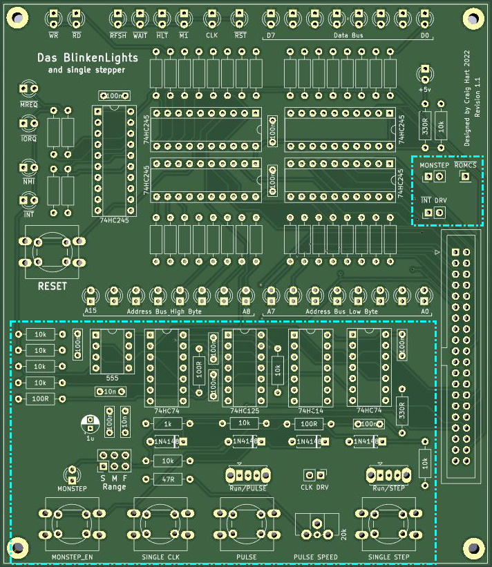

# Das Blinkenlights

Welcome to possibly the most complex board ever designed for the TEC & Southern Cross SC1!

Das BlinkenLights (henceforth DBL) is a multi-function add-on board designed for experimenters and programmers alike.

DBL features the following main functions:

### 36 Realtime Z80 CPU status LEDs
Visualize the state of the Z80 in real time – address, data and control busses all broken out into individual LEDs.

### Independent RESET button
Reset the CPU any time without needing to reach across to the main machine keypad.

### Single Clock
Step the CPU one T-State at a time.
Observe the operation of the Z80 in detail – both rising and falling clock edges can be held to verify the exact CPU timing and bus activity.

### Slow Clock
Drive the CPU clock at low speeds from ~10Hz to ~10KHz). Allows programs to be slowed down so that individual instruction cycles are visible on the status LEDs as they execute.

### MONSTEP Single Stepper
Supports JMON, SCMON and BMON software based single steppers triggered via the INT pin.

### Independent Single Stepper
Step the CPU one machine cycle at a time, any time, without software modification; uses the CPU’s WAIT pin to ‘pause’ operation.

---

---

Please See the [PDF file](Das%20Blinkenlights%20and%20Single%20Stepper.pdf)  for the full article and details.
